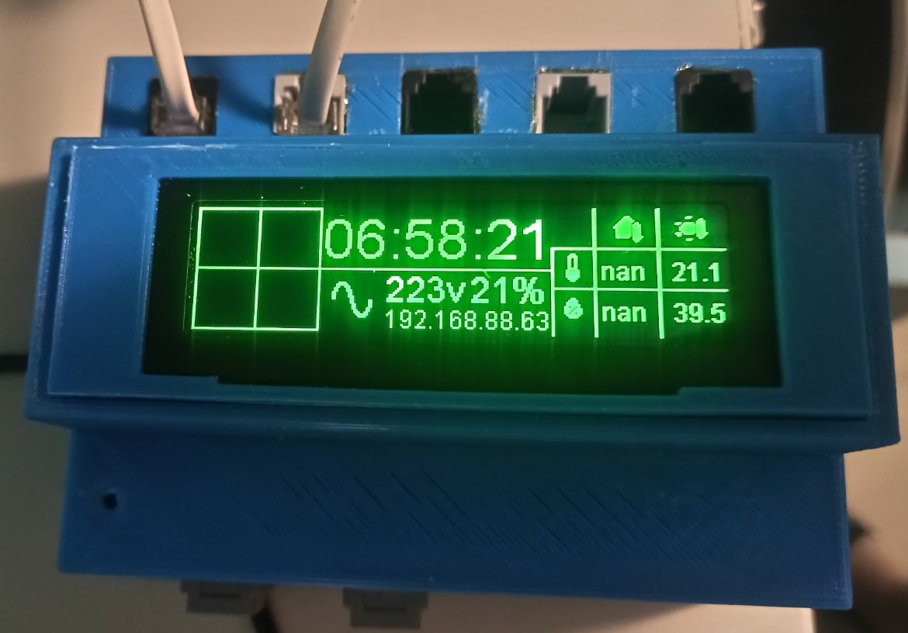

basement-controller
========================

.. seo::
    :description: Instructions for setting up a display in ESPHome to show sensor values from Home Assistant
    :keywords: Display

In this example I have used a :doc:`SSD1322 OLED Display over I²C </components/display/ssd1322>` to
show current time and two different temperature values from Home Assistant.

A controller for controlling the basement.

Monitors:
1. The operation of the submersible pump (on/off time, number of inclusions per day, duration of operation, current consumption) sensor ZMCT103C
2. The temperature outside and inside the designated storage room.
3. Climate control in the storage room (depending on the outdoor temperature hood, peltier elements (I plan to replace what that is more serious))
4. UPS monitoring
5. Exceeding the groundwater level, the output of an audio signal.

Animated display of statuses on the dss1322 display

A slightly modified component is used to monitor the UPS:

See Also
--------

- :doc:`/components/display/ssd1322`
- :doc:`/components/display/index`
- :doc:`/components/sensor/pulse_counter`
- :doc:`/components/sensor/pulse_meter`
- :doc:`/components/sensor/total_daily_energy`
- :doc:`/components/time/homeassistant`
- :ghedit:`Edit`
